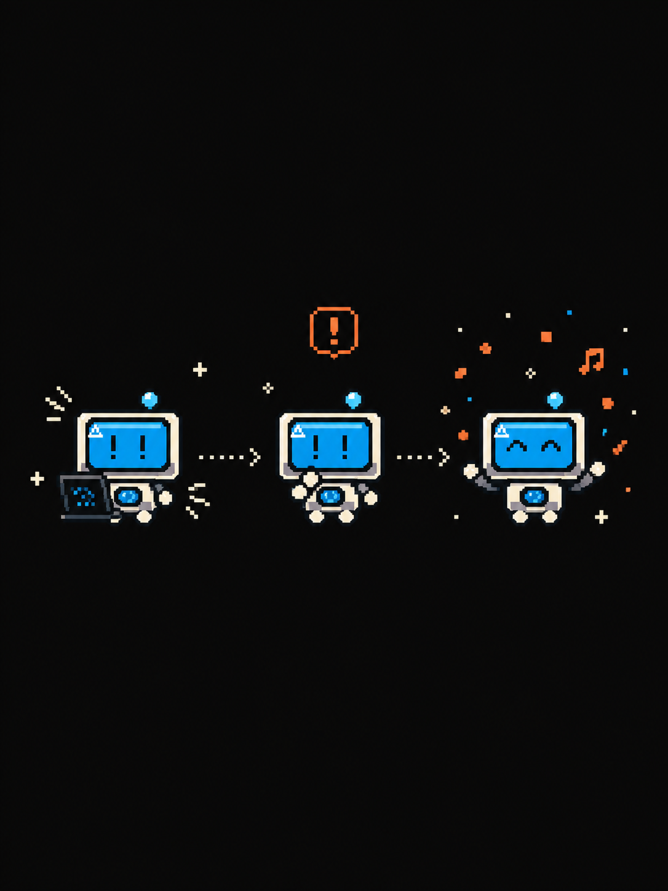
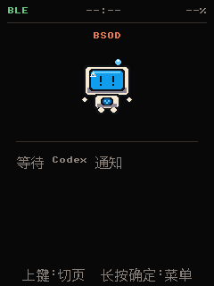

# Codex Buddy 中文提醒器



这是面向 FoloToy AI Passport 的中文 Codex 桌面提醒器。固件运行在 ESP32-C3 上，
通过加密 BLE 与 Windows 本地控制器通信，在 240 × 320 屏幕上显示 Codex 任务状态、
完成提醒、当前时间和剩余电量。项目参考了 FoloToy AI Passport 开源 BSP 与 Claude
Buddy 的公开交互协议，但产品名称和用户界面均为 **Codex Buddy**。

- 项目主页：<https://github.com/zhangsan2000w-art/ai-passport-codex-buddy>
- 固件下载：<https://github.com/zhangsan2000w-art/ai-passport-codex-buddy/releases>

> Codex Buddy 是社区实验项目，并非 OpenAI 官方硬件产品。实时状态和审批通过
> Codex 官方生命周期 Hook 接入；卡片仍使用 Claude Buddy 公开的 Hardware Buddy
> 心跳与审批交互语义。

## 版本迭代

Codex Buddy 从“能显示 Codex 状态”逐步迭代到“声音可靠、设置可用、连接后自动同步”的
完整体验。本次发布不是只替换一个 BIN，而是同时更新固件、Windows 状态桥、卡片说明和
使用文档。

| 版本 | 从哪里出发 | 迭代到哪里 |
| --- | --- | --- |
| v0.1.0 | 只有基础中文界面和状态显示 | 打通工作、审批、完成状态以及电脑与卡片双端审批 |
| v0.1.1 | 提醒能够触发，但声音偶尔不稳定，设置项也不够准确 | 修复审批与完成音效，加入五档音量，清理无效设置，并提供后台状态桥 |
| **v0.1.2** | 时间需要额外同步，部分开机状态下电量可能长期显示 `--%`，文档没有说清关机后的连接限制 | **连接后自动同步时间并立即读取电量；电量计未就绪时自动重试；明确卡片关机再开机后需要重新选择并连接** |

### v0.1.2 具体修改

- 固件版本从 `0.1.1` 升级到 `0.1.2`，重新生成可从 `0x0` 直接刷入的合并 BIN。
- Windows 控制器在每次连接成功后自动同步时间、使用者和当前状态，不再依赖手动同步。
- 卡片连接时立即读取自身电量；读取失败会自动重新初始化并定时重试。
- 只有电压可用时显示 `~50%` 这类近似电量，硬件完全无法读取时才显示 `--%`。
- 卡片“关于”页、主 README 和控制器 README 同步写明真实连接规则。
- 保留 v0.1.1 已修复的审批音效、完成音效、五档音量、蓝牙开关和双端审批能力。

## 一眼看懂怎么用

| 使用场景 | 需要做什么 | 控制器窗口 | 时间和电量 |
| --- | --- | --- | --- |
| 第一次使用 | 刷入最新 BIN，双击“安装 Codex Buddy”，打开控制器，扫描并选择 `Codex-*`，点击“连接” | 第一次必须打开 | 连接成功后自动同步，无需手动点击 |
| 第一次蓝牙确认 | Windows 弹出配对确认时点击允许，不需要输入六位数字 | 保持打开直到显示已连接 | 连接完成后自动显示 |
| 正常使用，卡片保持开机 | 正常打开 Codex 或 ChatGPT 使用即可 | 可以关闭，由后台桥继续运行 | 自动保持更新 |
| 只关闭并重新打开 Codex | 直接重新打开 Codex；确认 Hook 已启用 | 通常不需要打开 | 不受影响 |
| 卡片关机再开机 | 重新打开控制器，扫描或选择原来的卡片，再点击“连接” | 需要重新打开并连接一次 | 重新连接后自动恢复 |
| 重新刷入完整固件 | 先删除 Windows 中旧的 `Codex-*` 配对，再重新扫描、配对和连接 | 必须重新打开 | 新连接建立后自动恢复 |
| 换到另一台电脑 | 在新电脑安装一次 Codex Buddy 状态桥，再扫描、配对和连接卡片 | 第一次必须打开 | 连接成功后自动同步 |
| Windows 只显示“已配对” | 仍要确认控制器或后台桥已经真正连接；只有系统配对不能传送 Codex 状态 | 未连接时需要打开 | 真正连接前不会更新 |

最重要的规则只有两条：**蓝牙配对不等于状态桥已连接**；**连接成功后不需要再手动同步
时间或电量**。

## 怎么玩

1. 首次连接卡片，并在电脑上安装 Codex Buddy 小助手。用蓝牙连接小卡片，若重刷卡片需重置，电脑需忘记后再连。
2. 像平时一样打开 Codex、发送任务，BSOD 蓝屏小精灵会跟着进入工作状态。
3. 遇到授权请求时，可在卡片上允许或拒绝，也可以继续在电脑端处理；先操作的一端生效。
4. 任务完成后，小精灵会切换庆祝表情并播放专属完成提示。
5. 卡片保持开机时可以关闭控制器窗口，由后台桥继续运行；卡片关机再开机后，需要
   重新打开控制器，选择自己的卡片并点击连接。

等待、工作、授权和完成都有不同的表情与提示，让原本藏在电脑里的 AI 进度变得
一眼可见、随手可管，也多了一点像素宠物的陪伴感。



## 工作方式

本项目不调用额外的 OpenAI API，也不要求填写 API Key。数据只在本机与卡片之间传递：

```text
Codex / ChatGPT → 本地 Hook → Windows 本地桥 → 加密 BLE → Codex Buddy
Codex / ChatGPT ← 本地 Hook ← Windows 本地桥 ← 卡片审批按键
```

蓝牙配对只建立电脑与卡片之间的安全连接；Windows 本地桥仍需运行，才能把 Codex
状态同步到卡片。桥接程序只监听本机回环地址，不提供公网服务。

## 当前状态

这是可编译、可测试的开发者预览版。固件、Windows 控制器、实时状态桥和双端审批均已
实现；自动化测试覆盖协议、状态、BLE 策略、设置、音效逻辑和本地 Hook。不同批次卡片
仍应完成真机验证。20 次连接/断开循环和 30 分钟稳定性测试尚未作为公开发布门槛完成，
因此请勿把本仓库描述为量产固件。

## 已实现功能

- 全中文设备界面、中文按键说明和中文 Windows 控制器。
- 内置 4,342 字形的精简中文字库，覆盖全部设备界面和常用一级汉字；提醒摘要中的
  生僻字若不在字库中会回退为 `?`。
- BLE 名称为 `Codex-<MAC 后缀>`，首次连接通过 Windows Just Works 建立加密绑定，
  不需要输入配对码。
- 实时接收 Codex 的开始、工具执行、等待审批和完成状态，在卡片上同步显示。
- 真实审批支持电脑控制器与卡片同时操作；先提交的一端生效，另一端立即失效。
- 状态栏固定显示 BLE 状态、本地时间和电量百分比；数据不可用时显示占位符。
- 60 秒无按键操作后自动关闭屏幕背光；短按或长按任意功能键只唤醒屏幕，
  不会顺带触发翻页、菜单或审批。
- 默认宠物为 BSOD（tiny blue-screen gremlin），使用适合 ESP32-C3 的程序化像素绘制，
  提供待机、工作、等待、完成、失败和互动表情，不嵌入桌面版大型精灵图。
- 空闲、工作中、待确认、完成和休眠状态；设备信息、宠物、帮助和设置页面。
- 审批请求使用短促提醒双音，任务完成使用上行完成三音；音量可在设置页选择
  0%、25%、50%、75% 或 100%，0% 为静音，重新开机仍会保留。
- 三键操作、亮度设置、音量设置、蓝牙开关、设备端解除绑定和恢复出厂确认。
  设置页不展示当前固件未使用的无线网络、指示灯和屏幕旋转选项。
- 本地桥只监听 `127.0.0.1`，不转发用户输入；工具提示与完成摘要会按固定字节数截断。

更完整的硬件能力、接口成熟度与可开发方向见
[`docs/PRODUCT_CAPABILITIES.zh_CN.md`](docs/PRODUCT_CAPABILITIES.zh_CN.md)。

## 按键

- 上键：切换主页、宠物和信息页；待确认页面用于滚动。
- 下键：切换子页面；待确认页面用于拒绝。
- 确定键：确认当前操作；待确认页面用于单次允许。
- 长按确定键：打开或关闭菜单。
- 屏幕关闭时：上、下、确定任意键的短按或长按均只唤醒屏幕。

## 编译固件

需要 ESP-IDF 5.5.3：

```powershell
idf.py set-target esp32c3
idf.py build
python -m esptool --chip esp32c3 merge_bin -o build\merged-binary.bin -f raw `
  --flash_mode dio --flash_freq 80m --flash_size 4MB `
  0x0 build\bootloader\bootloader.bin `
  0x8000 build\partition_table\partition-table.bin `
  0x10000 build\Codex-Buddy.bin
```

普通烧录可使用 `idf.py flash monitor`。如需网页刷机，把生成的合并固件
`build\merged-binary.bin` 交给 FoloToy 的 Web Flasher；也可以按构建日志里的地址分别
上传 bootloader、partition table 和 application 三个二进制文件。这里显式使用
`--flash_size 4MB`，可避开 ESP-IDF 5.5.3 的 `merge-bin` 与部分 esptool 版本对
`--flash_size detect` 处理不一致的问题；该镜像头也能在容量更大的兼容批次上启动。

> 每次重新刷入完整固件后，都应重新建立蓝牙连接：先从 Windows“蓝牙和设备”中删除
> 原来的 `Codex-*`，再打开 Codex Buddy 控制器重新扫描并连接。仅显示“已配对”不代表
> 新固件已经与电脑重新建立可用连接。

## Windows 控制器

首次安装可直接双击 [`安装 Codex Buddy.cmd`](安装%20Codex%20Buddy.cmd)。脚本会创建项目
专用 Python 环境、安装 BLE 依赖、合并 Codex Hook，并注册当前用户的后台状态桥。
卸载时双击 [`卸载 Codex Buddy.cmd`](卸载%20Codex%20Buddy.cmd)，只移除后台启动项和
本项目的 Hook，不删除固件、蓝牙配对或其他 Codex 配置。

需要手动安装时，在仓库根目录执行：

```powershell
py -3.11 -m venv .venv-buddy
.\.venv-buddy\Scripts\python.exe -m pip install -r tools\windows_buddy_controller\requirements.txt
.\.venv-buddy\Scripts\python.exe -m tools.windows_buddy_controller.app
```

控制器中点击“扫描”，选择 `Codex-*` 并连接；首次连接若 Windows 显示配对确认，允许
即可，不需要在卡片或电脑上输入数字。
控制器会在每次连接成功后自动同步本地时间、使用者并读取设备状态，随后每 10 秒发送
一次状态保活，不需要再手动点击同步。电量由卡片自身读取；固件会在连接时立即刷新，
若电量计开机时尚未就绪，还会自动重新初始化并继续定时重试。
当电量计暂时只能提供电压而不能提供剩余百分比时，状态栏会显示带 `~` 的近似值，
例如 `~50%`；硬件读数完全不可用时才显示 `--%`。

如果重新刷机后仍能扫描、Windows 也显示“已配对”，但连接在 60 秒后超时，通常是两端
保留的旧绑定密钥不一致。先在卡片进入“设置 → 重置 → 取消配对”，再从 Windows
“蓝牙和设备”中删除对应的 `Codex-*` 设备，然后重新配对。

首次成功连接后，双击 [`安装后台自动连接.cmd`](安装后台自动连接.cmd)。此后 Windows
登录时会无窗口启动 Codex Buddy 状态桥。卡片保持开机且连接未被重置时，日常不需要
打开控制器；短暂断线时后台桥也会尝试恢复。受当前真机连接行为限制，卡片关机再开机
后仍需要打开控制器，重新扫描或选择自己的 `Codex-*`，再点击“连接”。连接成功后即可
关闭窗口，时间、电量和 Codex 状态都会自动同步，不需要点击手动同步。双击
[`卸载后台自动连接.cmd`](卸载后台自动连接.cmd) 只移除当前用户的自动启动项，不会
删除蓝牙配对或固件。

### 在另一台 Windows 电脑使用

卡片不能只靠蓝牙配对直接读取 Codex 状态；每台电脑都需要安装一次本地状态桥。推荐按
下面的顺序操作：

1. 下载或克隆本仓库，双击 [`安装 Codex Buddy.cmd`](安装%20Codex%20Buddy.cmd)。
2. 安装完成后打开控制器，点击“扫描”，选择当前卡片的 `Codex-*` 并连接。
3. Windows 出现配对确认时选择允许；连接成功后可以关闭控制器窗口。
4. 安装器注册的后台状态桥会在 Windows 登录后无窗口启动。卡片保持开机时可继续使用；
   如果卡片关机再开机，请重新打开控制器，选择卡片并点击“连接”。
5. 连接后不需要手动同步时间或电量。完全退出并重新打开 Codex，发送一个任务，确认
   卡片依次显示工作、授权和完成状态。

如果这台电脑此前连接过刷机前的同一张卡片，请先删除 Windows 中旧的 `Codex-*` 配对，
再执行第 2 步。状态桥不调用额外的 OpenAI API，也不需要填写 API Key。

## 连接当前 Codex

先运行一次安装器。它会把 Codex Buddy 条目合并进用户级 `.codex/hooks.json`，保留
已有 Hook，并在修改已有文件前创建带时间戳的备份：

```powershell
.\.venv-buddy\Scripts\python.exe -m tools.windows_buddy_controller.install_codex_hooks install
```

然后重启 Codex，并在出现 Hook 信任提示时确认。保持手动控制器或后台桥运行并连接卡片：

- 发送提示后，卡片立即显示“Codex 正在处理任务”。
- 工具执行时同步工具名称和经过截断的提示。
- 需要审批时，电脑控制器和卡片显示同一个请求。电脑点击“一次允许/拒绝”，或卡片
  按 `OK`/`DOWN`；先到的有效决定生效，重复、过期或编号不匹配的决定会被拒绝。
- 控制器未运行或本地桥不可用时，Hook 不做决定，Codex 继续显示自己的原生审批提示。
- Codex 完成后同步明确的完成状态，显示完成动画并播放完成音效。

卸载只删除 Codex Buddy 自己的 Hook 条目：

```powershell
.\.venv-buddy\Scripts\python.exe -m tools.windows_buddy_controller.install_codex_hooks uninstall
```

旧版 `config.toml` 的 `notify` 完成提醒仍可兼容，但安装实时 Hook 后建议移除旧 `notify`，
避免同一完成事件被发送两次。

## 测试

Windows 控制器测试不需要开发板：

```powershell
$env:PYTHONPATH = "tools"
python -m unittest discover -s tools\windows_buddy_controller\tests -v
```

C 固件逻辑测试与正式构建：

```powershell
cmake -S tests -B build-host
cmake --build build-host
ctest --test-dir build-host -C Debug --output-on-failure
idf.py build
```

## 上板验收

- `Codex-*` 能被 Windows 扫描，首次确认、加密连接、重连和解除绑定正常。
- 中文无乱码、无截断；主页、状态栏、菜单、设置、确认页在 240 × 320 屏幕上可读。
- 连接成功后时间会自动同步，电量会立即读取并持续刷新；电量计暂时未就绪时会自动
  重试，硬件持续不可用时才显示 `--%`，不会由电脑伪造电量。
- 60 秒无按键后背光关闭，三枚按键的短按和长按都能唤醒且不误操作。
- 开始、工具、审批和完成事件能从 Codex 到达 Windows 控制器，再到卡片。
- 审批与完成音效不同；音量五档可调，设为 0% 后均静音，重新开机仍保持设置。
- 后台桥能无窗口自动启动；卡片保持开机时持续工作。卡片关机再开机后，按当前真机
  行为重新选择并连接，且不会误连其他卡片。
- 同一审批可从电脑或卡片处理且只生效一次；控制器关闭时能回退到 Codex 原生审批。
- 至少完成 20 次连接/断开和 30 分钟连接测试，记录堆内存、看门狗与 BLE 错误。

没有连接真实开发板的检查必须标记为 `NOT RUN`，不能用编译通过代替硬件验收。

## 目录

```text
components/bsp/                    FoloToy AI Passport 板级驱动
main/                              Codex Buddy 固件、状态、BLE、协议和中文 UI
tests/                             主机端 C 测试
tools/windows_buddy_controller/    Windows 中文控制器与 Codex 本地通知桥
docs/                              硬件能力说明与历史设计记录
```

本项目采用 [`MIT License`](LICENSE)。协议来源与上游许可证归属见 [`NOTICE`](NOTICE)。
